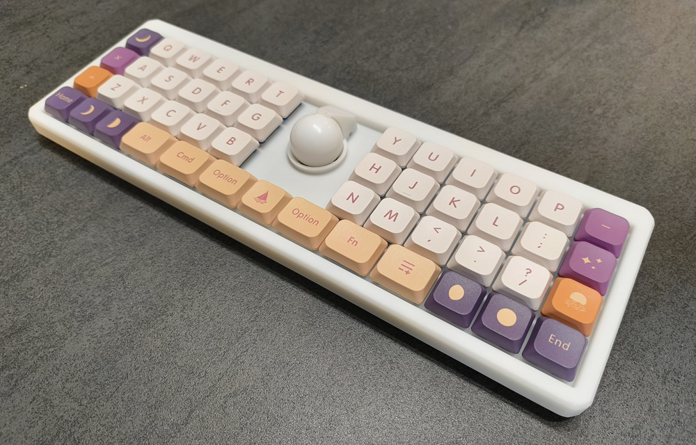
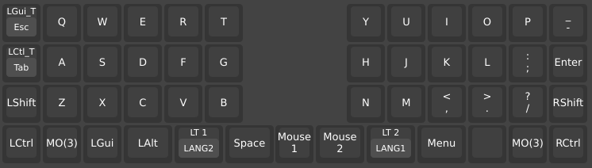
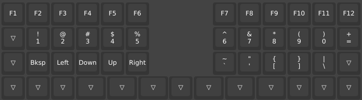
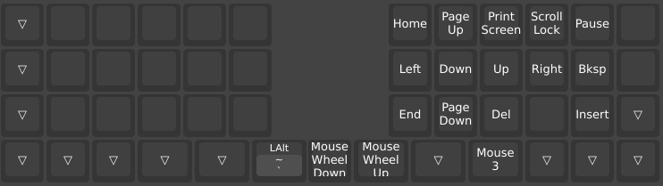
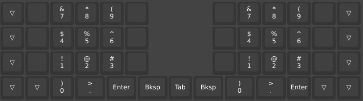
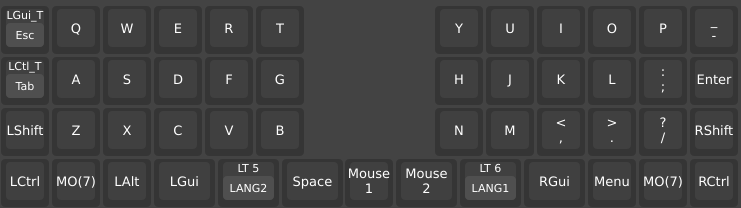
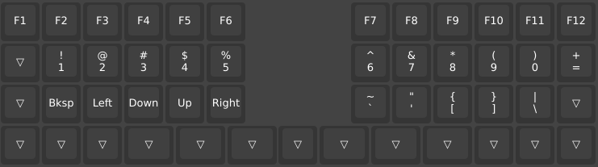
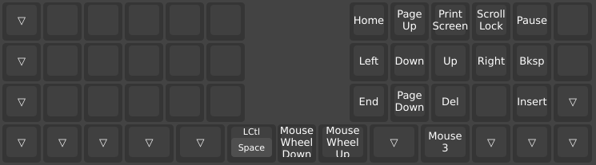
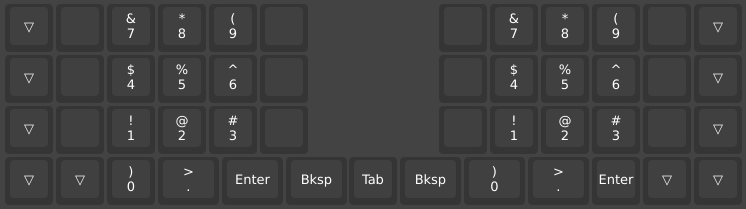

# LightSeeker
Light Seeker is an unibody wired keyboard which has ortholinear 49 keys and 25mm trackball.
This keyboard was generated by [Auto-Keyboard-Design-Kit](https://auto-kdk.pages.dev/) and QMK firmware has been slightly customized.

## Parts List
### Parts need to be prepared/purchased
|Part|Quantity|Remarks|
|---|---|---|
|Wired controller board (RP2040)|1|Available on BOOTH (https://nogikes.booth.pm/items/6604431)|
|Conthrough(2.5mm, 11pin)|2|Included in the above|
|USB-C cable|1|To connect between PC and the keyboard|
|Choc socket|49|e.g. Kailh PG1350 KeySwitches Contact (CPG135001S30)|
|Choc V2 switch|49||
|Diode|49|e.g. 1N4148W. Not neccesary in the case you assemble it in PCB service.|
|Keycap|49|1u keycap x 43, 1.25u keycap x 6|
|14mm mouse sensor module (PAW3222)|1|Available on BOOTH (https://nogikes.booth.pm/items/6520217)|
|2mm ceramics ball (as support ball)|3||
|FFC cable (150mm length, 0.5mm pitch, 6pin)|1||
|25mm trackball|1||

### Parts need to be ordered/printed
|Part|Quantity|Remarks|
|---|---|---|
|PCB|1|Order a PCB using pcb/LightSeeker-pcb.json|
|Keyboard case (Top)|1|Print a case using case/LightSeeker-top-case.stl|
|Keyboard case (Bottom)|1|Print a case using case/LightSeeker-bottom-case.stl|

## Keyboard build instruction
Please refer the below:

* Keyboard itself: https://github.com/sekigon-gonnoc/auto-kdk
* Trackball: https://github.com/sekigon-gonnoc/auto-kdk/blob/master/manual/TrackBall.md

## Firmware build instruction
### By GitHub Actions
* Fork this repository and let GitHub Actions to build a firmware.

### By QMK Firmware
* <s>[T.B.D.] Firmware may be built by place qmk_firmware/keyboards/lightseeker directory into keyboards directory of QMK firmware then exec `qmk compile -kb lightseeker -lm vial` but I hadn't verified it yet</s> => Useful for build check but firmware is not work.

## Default key layout
### Windows/Linux/Android
Layer0: Default Layer

Layer1: Function, Number & Punctuation

Layer2: Command & Cursor Layer

Layer3: Numpad

### MacOS/iOS
Layer4: Default Layer

Layer5: Function, Number & Punctuation

Layer6: Command & Cursor Layer

Layer7: Numpad

## Note) Customizations on QMK firmware from originally generated by Auto-KDK
* Fixed the bug that the firmware didn't recognize one column in right side of the keyboard.
* Increased number of layers to 8.
* Enabled OS detection and place default layer of MacOS/iOS into layer#4.
* Added drag-scroll (scroll using trackball) functionality.